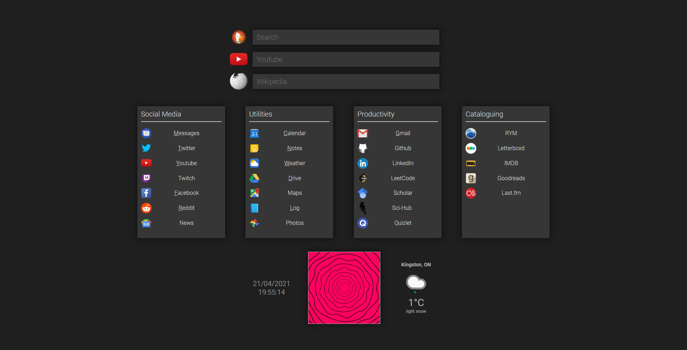

# new-tab-page

A personal project to learn web fundamentals (html, css, javascript).
Has links to all my most used website, along with search functions for duckduckgo, youtube, and wikipedia.
Also displays the current time, date, weather, and includes a randomized flavor gif.

